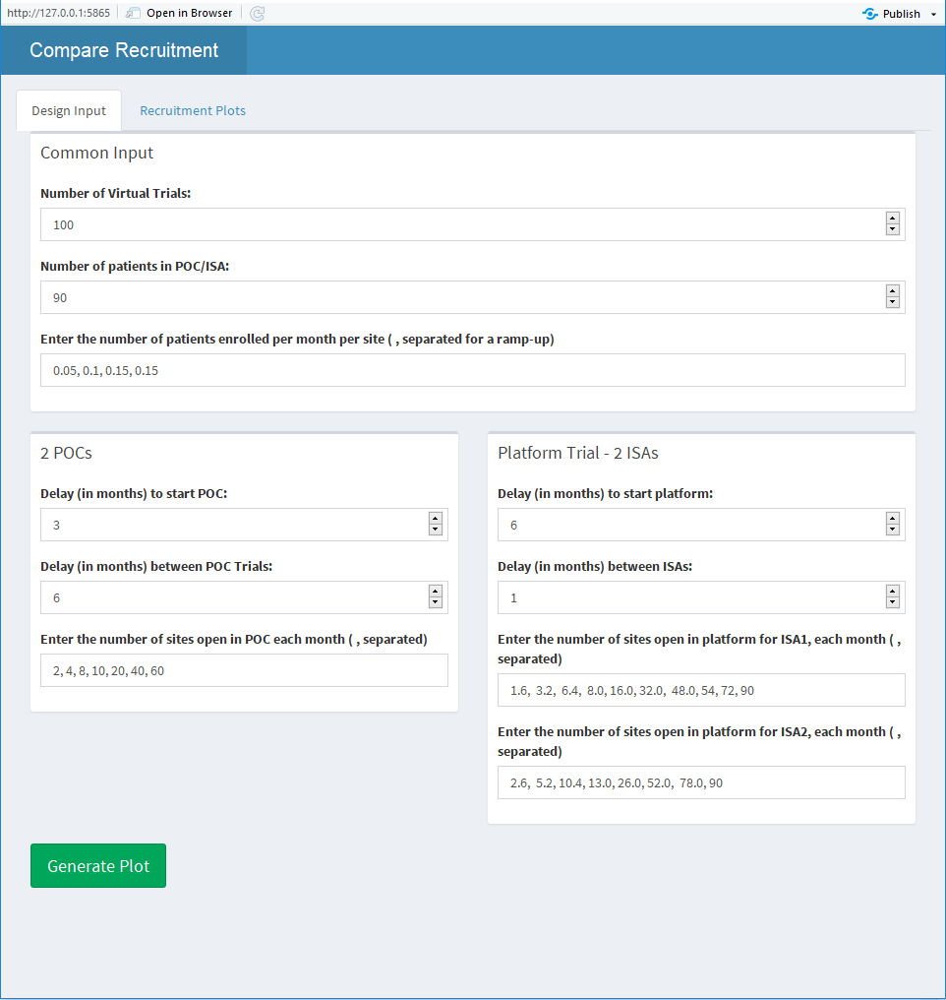
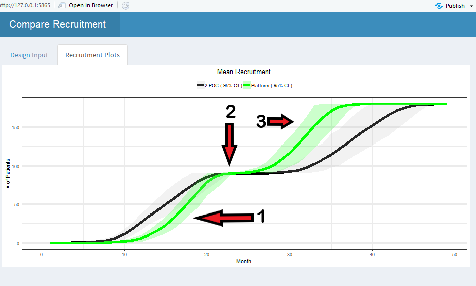

```{r setup, include=FALSE}
knitr::opts_chunk$set(echo = TRUE)
```

One of the first tasks that is typically conducted by a team is the comparison of patient recruitment in a platform trial with two ISAs versus two sequential POC studies.  This case study utilized the R Shiny App in this package to compare the recruitment under a given set of assumptions regarding patient recruitment rates, number of sites and time delay for platform trial versus consecutive POC studies.  The focus of this case study is on the operational comparisons rather than statistical comparisons.   

## Assumptions 
* Assume 2 ISAs, named ISA 1 and ISA 2.
* Assume ISA 2 is ready in about 24 months.
* Starting a platform trial will take longer to get approved and set-up. 
* Assume a platform trial will have more sites due to the longer recruitment and multiple therapies when compared to two independent
* Opening sites in the platform will be slower than the 1<sup>st</sup> POC 
* Getting approval for the 2<sup>nd</sup> ISA will be quicker than open the 2<sup>nd</sup> POC since it will be a new protocol.
* Assume N = 90 patient for each ISA or POC.
* Within a site assume it takes time to ramp-up accrual
    + 4 months to get to the maximum rate of 0.15 patient/month within a site
    + Assume 0.05, 0.1, 0.12, 0.15 patients for month 1,2,3,4 and 0.15 there after when a new site opens
* It takes time to open sites, the amount of time is dependent on POC vs Platform

* 2 POC trials  
	+ Assume 60 sites for each POC
	+ Assume it takes 7 months to open all 60 sites for each POC
	+ Assume 3 months is required to start the first POC
	+ Assume 6 months between the end of the first POC and the second

* Platform trial with 2 ISAs
	+ Assume 90 sites in platform	
	+ The 1<sup>st</sup> ISA will open 80% the rate of the 1<sup>st</sup> POC
	+ 2<sup>nd</sup> ISA will open sites at a rate of 130% of the 2<sup>nd</sup> POC, this is due to the fact that the only the ISA is approved and should take less time.
	+ Assume 6 months to start the platform
	+ Assume 1 month between ISAs

## R Source
 This case study is easily done using the R Shiny App included in the package.  To launch the R Shiny App the following code can be used.
 
```{r, eval = FALSE}
library( OCTOPUS )
OCTOPUS::RunExample( "CompareRecruitment" )
```

After launching the app the following screen Shiny app is started with defaults set for Case Study 1.




The are four inputs that require a comma separated string, see for example "Enter the number of patients enrolled per month per site".   When the "Generate Plot" is pressed virtual trials are simulated and a plot is displayed.  

## Results
In the Shiny App after clicking the "Generate Plot" button, the Recruitment Plots will automatically be displayed.  The three main components that factor into the result are: 1) the delay in starting the platform, 2) the shorter duration to start the second ISA when compare to starting the second POC and  3) the increased number of sites in the platform.   In Figure 2 below, these items can be seen in and the effect marked with the corresponding number.   Item 1, results in the platform recruitment initially being slower and lower than the first POC.   Item 2 is observed by the small flat section for the platform when compared to the POC option.   Finally, Item 3 is best observed in the second POC/ISA because the slope is easily identified as steeper (faster recruitment) for the platform compared to the POC version. 




