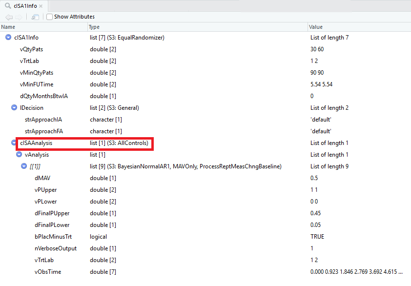

```{r setup, include=FALSE}
knitr::opts_chunk$set(echo = TRUE)
```


This case study (CS) builds on [Case Study 3](https://kwathen.github.io/OCTOPUS/articles/CaseStudy3.html) by adding a second ISA and introduces the concept of simulating the entry type of ISA 2.  For simplicity, this case study assumes both ISAs have 2 treatment ( control vs treatment ) and assume the same treatment effect for both experimental arms.  

In this case study, the ability to "borrow" control patients is demonstrated for the first time.  Each ISA must specify what type of borrowing is done.   This allows an ISA to either borrow the control patients or only utilize the patients within the ISA on an ISA level rather than at the trial level, more detail about borrowing below.   

For CS 4, we utilize the patient simulator that is included with the package rather than adding a new one.

The R code may be found in the Examples/CaseStudy4

## Assumptions 

### Trial Design Elements
* Platform trial with 2 ISAs
* No Interim analysis
* Final Analysis (FA) when all patients have the outcome observed.
* 30 patients on control (C) 60 patients on treatment (T)
* Primary outcome is repeated measure evaluated at baseline, 4, 8, 12, 16, 20 and 24 weeks after treatment
* Analyze difference from baseline to week 24 compared to control using a Bayesian AR(1) model. 
* Minimum Acceptable Value MAV = 0.5 difference between control and treatment
    + This is the minimum difference between treatment and control 
    $$ ( \mu_{24} - \mu_0 )_{C} – (\mu_{24} - m_0 )_{T}$$

* Decision Rules
    + Define $\delta_C = ( \mu_{24} - \mu_0 )_{C}$ and $\delta_T = (\mu_{24} - m_0 )_{T}$
    + If  $\rho = Pr( \delta_C - \delta_T$ > MAV | data ) $> P_U = 0.8$ then make a "Go" decision
    + If Pr( $\delta_C - \delta_T$ > MAV | data ) $< P_L = 0.1$ then make a "No Go" decision
    + Otherwise the decision is indeterminate 

If the goal at the end of the study is to make a decision of Go or No Go, then $P_U = P_L$. 

In the context of this case study, patient outcomes are not expected to change over the 24 weeks for the control treatment, where as the treatment is expected to decrease the values of the patient outcomes.  Thus, $\delta_C - \delta_T$ is expected to be greater than 0 for effective treatments and consequently, high values for $\rho$ indicate an effective treatment.

 The function SetupTrialDesign() is located in [TrialDesign.R](https://github.com/kwathen/OCTOPUS/blob/master/inst/Examples/CaseStudy4/TrialDesign.R) and the function is called to build the trial object from the BuildMe.R file in this example.
    
### Simulation Design Elements 

The simulation object contains all information to specify how the trial is simulated.   Specifically, it contains a list of scenarios, such as the null and alternative,  details about patient accrual rates and in a multiple ISA setting information about how and when the second and subsequent ISAs are added to the trial.  

For case study 4, the data for each patient is simulated from a multi-variate normal with a binary covariate. The patient covariate is specified as a responder or non-responder and the outcome value over time is simulated from a MVN with a separate mean vector specified for responders and non-responders.    Based on the historical data we have the following means for responders and non-responders shown below is used to specify various scenarios in the simulation study, more detail provided below.  

#### Table  1 - True Means

```{r stup, echo=FALSE}

    nQtyCol   <- 7

    vMeanTrt  <- c( 3.5, 3.4, 3.0, 2.5,  2.9, 1.4, 0.9 )
    vMeanCtrl <- c( 3.5, 3.5, 3.5, 3.5,  3.5, 3.5, 3.5 )

    mVarCov   <- matrix( c( 0.5, 0.4, 0.4, 0.4, 0.4, 0.4, 0.4,
                            0.4, 0.5, 0.4, 0.4, 0.4, 0.4, 0.4,
                            0.4, 0.4, 0.5, 0.4, 0.4, 0.4, 0.4,
                            0.4, 0.4, 0.4, 0.5, 0.4, 0.4, 0.4,
                            0.4, 0.4, 0.4, 0.4, 0.5, 0.4, 0.4,
                            0.4, 0.4, 0.4, 0.4, 0.4, 0.5, 0.4,
                            0.4, 0.4, 0.4, 0.4, 0.4, 0.4, 0.5), ncol=nQtyCol )
    dfMean <- data.frame(  rbind( Nonresponders =vMeanCtrl,Responder=vMeanTrt)  )
    row.names( dfMean) <- c("Non-responders", "Responders")
    colnames(dfMean) <- c( "Baseline", paste("Week",seq(4,24,4)))
    knitr::kable( dfMean, caption="True Means", label="TrueMeans" ) 
    
    
    mVarCov   <- matrix( c( 0.5, 0.4, 0.4, 0.4, 0.4, 0.4, 0.4,
                            0.4, 0.5, 0.4, 0.4, 0.4, 0.4, 0.4,
                            0.4, 0.4, 0.5, 0.4, 0.4, 0.4, 0.4,
                            0.4, 0.4, 0.4, 0.5, 0.4, 0.4, 0.4,
                            0.4, 0.4, 0.4, 0.4, 0.5, 0.4, 0.4,
                            0.4, 0.4, 0.4, 0.4, 0.4, 0.5, 0.4,
                            0.4, 0.4, 0.4, 0.4, 0.4, 0.4, 0.5), ncol=nQtyCol )


```

In addition, the estimates of the variance/covariance over time is 

#### Table 2 - Variance/Covariance Matrix


```{r echo=FALSE}

write_matrix <- function(strMatrixName, mMatrix) {
  begin <- paste( "$$", strMatrixName, " = \\begin{bmatrix}", sep="")
  end <- "\\end{bmatrix}$$"
  X <-
    apply(mMatrix, 1, function(x) {
      paste(
        paste(x, collapse = "&"),
        "\\\\"
      )
    })
  paste(c(begin, X, end), collapse = "")
}


```


`r write_matrix( "V",mVarCov)`

In general, the responders and non-responders could have different var-cov matrix but for simplicity in this case study they are assumed to be the same.  

The trial recruitment is specified in terms of the number of patients accrued per month per site (patients/month/site) and the number of sites open in the platform.  For simplicity, the ramp-up in the number of patients/month/site is not applied within a site and recruitment to the platform assumes a Poisson process with the rate equal to the number of patients/month/site * number of sites open.  

To specify the scenarios, each treatment specifies a percent of patients that are responders and non-responders.   For the control treatment, the percent of responders is 2% in all scenarios.   The treatment are varies the percent of responders from 2% (the null case) to 40%. 

During the simulation of a virtual trials, a patient is first simulated as a responder or non-responder and then their observed values over time from the corresponding MVN.  In this case study, an effective treatment is expected to move patients from the non-responder category to the responder category.   

The function SetupSimulations() is located in [SimulationDesign.R](https://github.com/kwathen/OCTOPUS/blob/master/inst/Examples/CaseStudy4/SimulationDesign.R) and the function is called to build the simulation object for the BuildMe.R file in this example.
 
## R Code
Begin with the BuildMe.R file.    This file loads the OCTOPUS package and sources the design file.  
The file TrialDesign.R contains the function necessary to set-up the design object.
The file SimulationDesign.R contains the functions necessary to set-up the simulation design.  In this case study, it is important to look at both the TrialDesign.R and SimulaitonDesign.R to understand how the addition of a second ISA impacts the trial design and simulation design elements. 

## Borrowing Control Patients
In this case study a second ISA is included for the first time. Since borrowing is at the ISA level, each ISA can have a different borrowing approach, eg ISA 1 could perform no borrowing and ISA 2 could utilize patients from ISA 1.   There are two parts to determining how data is borrowed across ISAs.  The first part is determined by how the dataset is created for analysis (includes  control patients for all ISAs or just the specific ISA) and the second part is determined by the analysis method.  

In order to share information between ISAs, when a virtual trial is simulated and the dataset created for analysis, the dataset can include data from other ISAs. The code snip below was taken from the  [TrialDesign.R](https://github.com/kwathen/OCTOPUS/blob/master/inst/Examples/CaseStudy4/TrialDesign.R) and creates the object for ISA 1 is created.   

```{#numCode .R .numberLines}
    strBorrow <- "AllControls"
    strModel  <- "BayesianNormalAR1"
    vPUpper   <- c( 1.0, 1.0 )
    vPLower   <- c( 0.0, 0.0 )
    dFinalPUpper <- 0.45
    dFinalPLower <- 0.05

    vQtyPats     <- c( 30, 60 )  # Control, Treatment
    vMinQtyPats  <- c( 90, 90 )
    vMinFUTime   <- c( 24* dConvWeeksToMonths, 24* dConvWeeksToMonths)
    dQtyMonthsBtwIA  <- 0.0

    ########################################################################.
    #  ISA 1 Information                                                ####
    ########################################################################.

    cISA1Info <- Create1DosePh2AISA( vQtyPats     = vQtyPats,
                                     vTrtLab      = c( 1, 2 ),
                                     vPUpper      = vPUpper,
                                     vPLower      = vPLower,
                                     dFinalPUpper = dFinalPUpper,
                                     dFinalPLower = dFinalPLower,
                                     strBorrow    = strBorrow,
                                     strModel     = strModel,
                                     vMinQtyPats  = vMinQtyPats,
                                     vMinFUTime   = vMinFUTime,
                                     dQtyMonthsBtwIA = dQtyMonthsBtwIA )
```


On line 1 in the code block above, the strBorrow is set to "AllControl" and sent as an argument in Create1DosePh2AISA which is included into the design element for ISA 1.  A view of the cISA1Info object is provided below, note the red box to highlight the S3 class of AllControls.   This class determines how the dataset is created before the analysis is performed.  This option will result in the dataset including all control patient data.  



In this example, the dataset is created with all control patients and the RunAnalysis function determines how to analyze the data.  In this example, all control patients are utilized the same regardless of which ISA they were enrolled into.   Many approaches for borrowing control patients could be developed, such as hierarchical borrowing, time dependent patient weights or dropping all control patients enrolled prior to the start of an ISA.  
